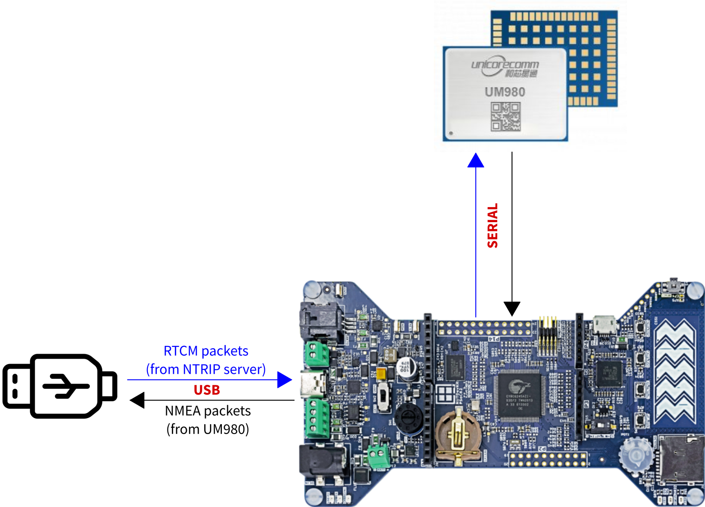

# RDK2_UM980_NTRIP_Client

The software first initializes the UM980 as rover mode and then acts as a gateway. 
- It converts packets received by USB (RTCM correction packets from an NTRIP server) into packet that are sent through the UART channel to the UM980.
- It converts packets received by the UART (sent by the UM980) (NMEA packets - posiition) into packet that are sent to the computer over USB.

<figure>
    
</figure>
