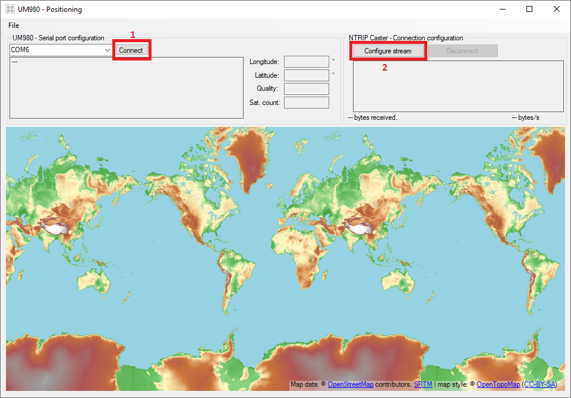
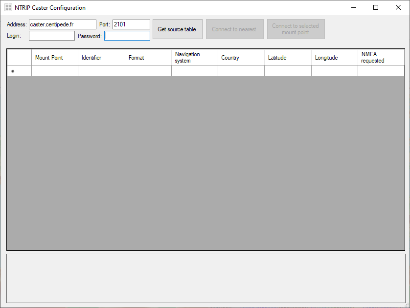
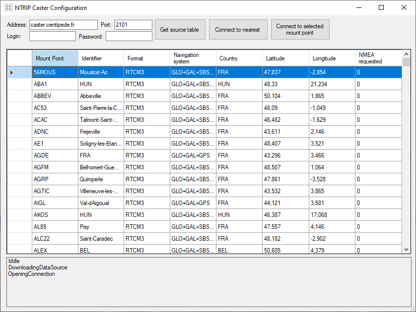
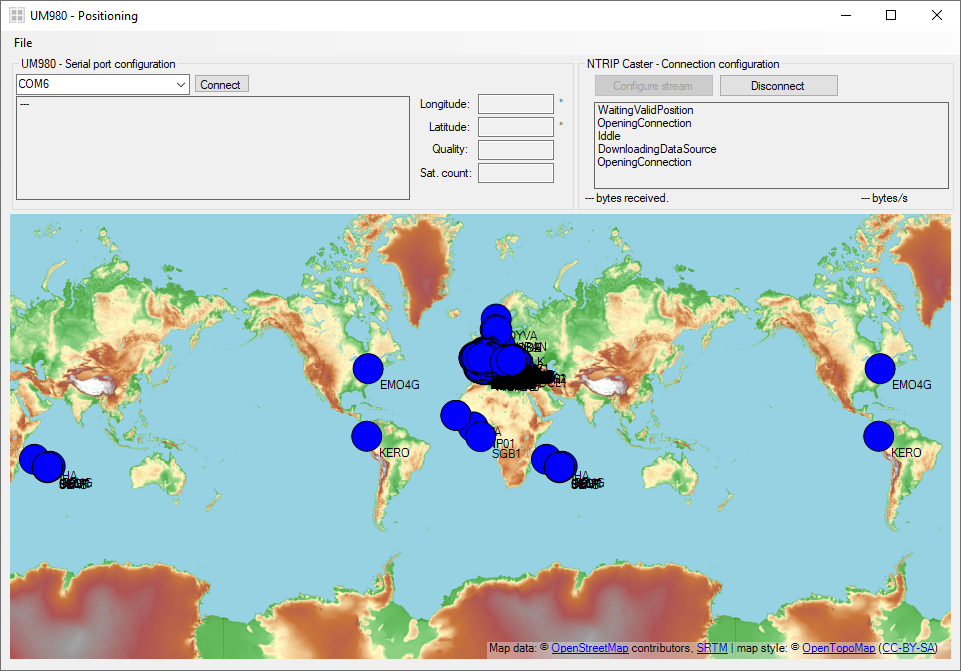
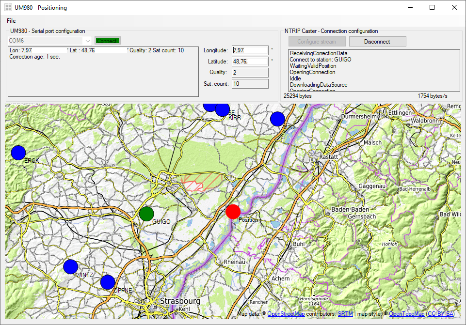

# RDK2_UM980_NTRIP_Client / GUI

The GUI enables to select the NTRIP caster (sending correction data) and enables to display the actual localisation.

<figure>
    
</figure>

If you do not want to receive correction values from an NTRIP caster, just ensure that a RDK2 with the correct software running on it is connected to the laptop and press the "Connect" [1] button.

If you want to receive correction values from an NTRIP caster, press the "Configure stream" [2] button. A new window will open:
<figure>
    
</figure>

Enter the address, port and login and password (if necessary) and the press on the button "Get source table". The software will attempt to connect to the server and will try to download its source table (the list of stations available). If it succeed, you will see something like:

<figure>
    
</figure>

Now you have 2 possibilities:
- Press the "Connect to nearest" button: the software will select the nearest mount point, connect to it and receive correction data
- Press the "Connected to selected mount point" button: you first need to select a mount point inside the list. This is needed in case, for example, you are using a virtual reference station

After clicking one of those button, the window will close, and the software will wait until a valid position (using the RDK2/UM980) is available.

<figure>
    
</figure>

Use the "Connect" button to open the connection with the RDK2 and you will then receive localisation from it.

<figure>
    
</figure>