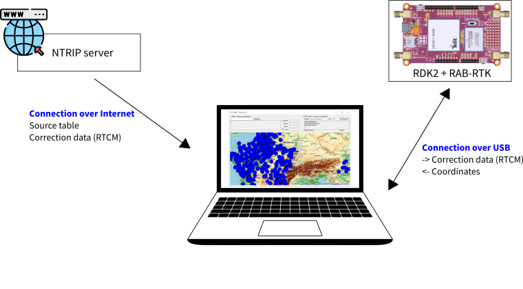
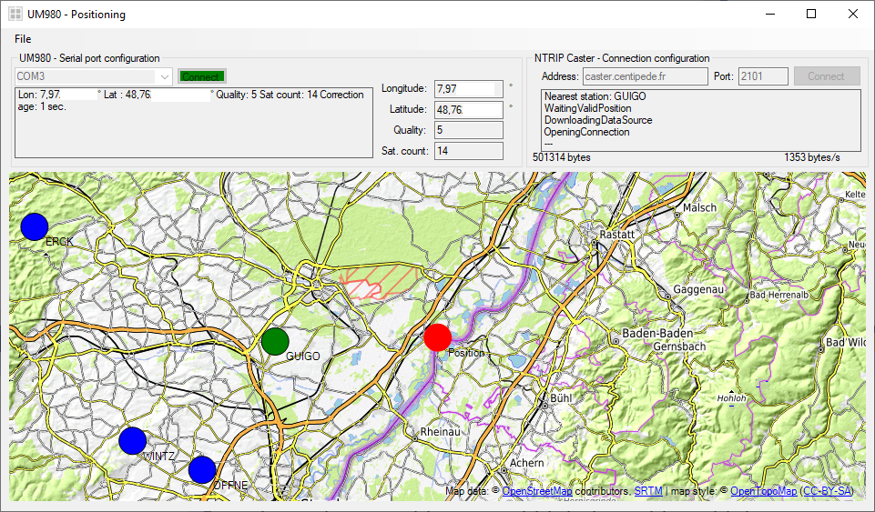
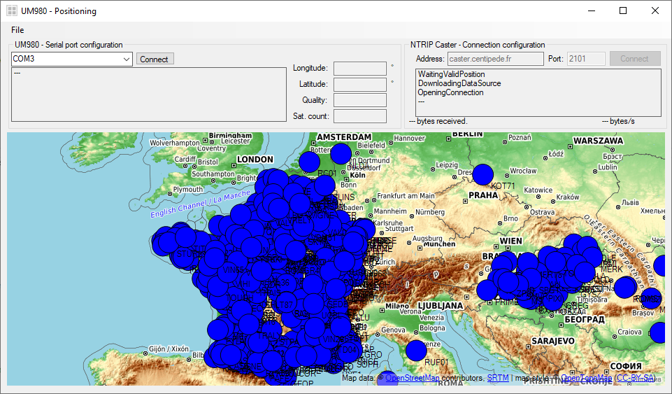
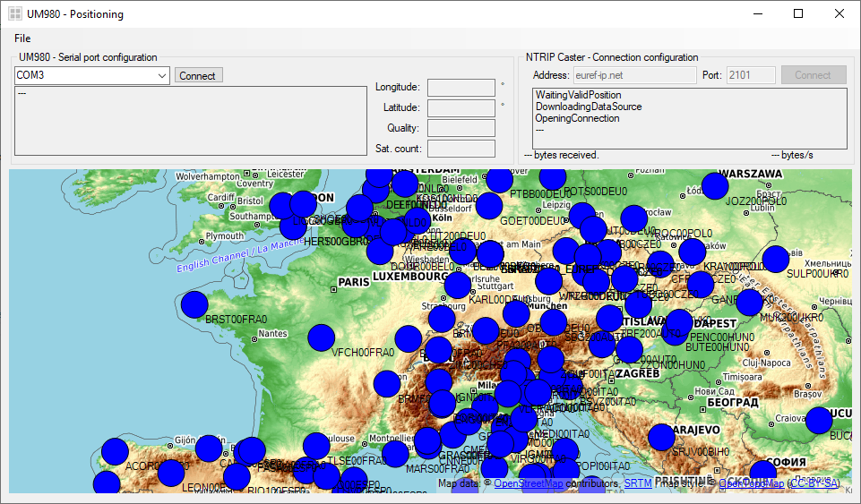

# RDK2_UM980_NTRIP_Client

This example demonstrates how to use the correction data sent by a NTRIP caster to enhance the accuracy of the position delivered by the UM980.

The raw correction data are directly sent to the UM980. The correction is performed directly inside the UM980.

<figure>
    
</figure>

<figure>
    
    <figcaption>Screenshot of the GUI. Using correction data from a Centipede server.</figcaption>
</figure>

## Requirements

- [ModusToolbox™ software](https://www.infineon.com/cms/en/design-support/tools/sdk/modustoolbox-software/) v3.x
- [RDK2](https://www.rutronik24.com/product/rutronik/rutdevkit-psoc62/16440182.html)
- [RAB-RTK](https://www.rutronik.com/innovations)
- GPS Antenna

## Using the code example

This repository stores 2 directories:
- BSP: Contains a project that can be imported into Modus Toolbox. Follow the user manual to see how.
- GUI: Contains a Visual Studio project (C#). It also contains a binary data that can be executed if you do not want to compile the project yourself.

Once the BSP has been uploaded on the RDK2, start the GUI and choose the correct COM port. Press on connect to receive the coordinates from the RDK2/UM980 sensor.

The current position is display as a red circle.

### Receive correction data from an NTRIP caster
To improve the accuracy of the coordinates measured by the UM980, you can use correction data. To do so, enter a valid address and a valid port. The software will first download the list of station arround, and connect to the closest one.

The stations are displayed in blue on the map, and the nearest station (on which we open the connection) is displayed in green.

Available server address:
- For France: caster.centipede.fr / Port: 2101
- For Europe: euref-ip.net / Port: 2101

    The euref-ip.net server is free, but you need to register first at this address: https://register.rtcm-ntrip.org/cgi-bin/registration.cgi

To be sure that the sensor can handle the correction data, check the value of "correction age" and the value of "quality". If "correction age" stays to the value 0, the sensor does not understand the correction data. Be sure that the RTCM version is OK.

<figure>
    
    <figcaption>Stations of the centipede network.</figcaption>
</figure>

<figure>
    
    <figcaption>Stations of the euref-inet network.</figcaption>
</figure>

## Legal Disclaimer

The evaluation board including the software is for testing purposes only and, because it has limited functions and limited resilience, is not suitable for permanent use under real conditions. If the evaluation board is nevertheless used under real conditions, this is done at one’s responsibility; any liability of Rutronik is insofar excluded. 

